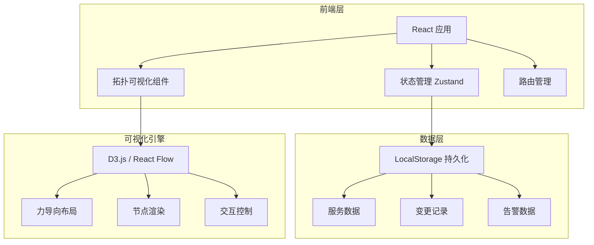
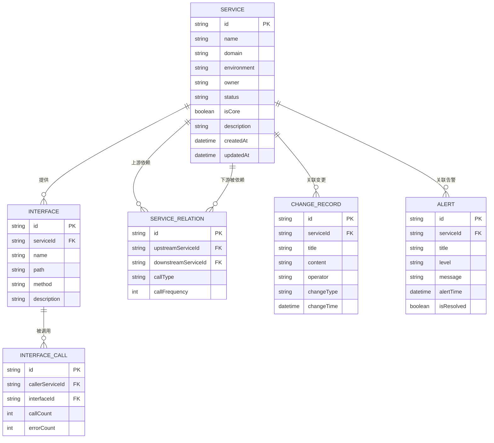

## 1. 架构设计



## 2. 技术说明

- **前端框架**：React 18 + TypeScript + Vite
- **样式方案**：Tailwind CSS 3.4 + CSS Variables
- **状态管理**：Zustand（轻量级状态管理）
- **路由管理**：React Router 6
- **可视化库**：React Flow（拓扑图）+ D3.js（辅助图表）
- **图标库**：Lucide React
- **数据持久化**：LocalStorage（前端模拟后端数据）
- **构建工具**：Vite 5

**初始化工具**：`npm create vite@latest service-topology -- --template react-ts`

## 3. 路由定义

| 路由 | 页面 | 说明 |
|------|------|------|
| `/` | 拓扑总览 | 默认首页，展示服务拓扑图 |
| `/topology` | 拓扑总览 | 服务拓扑可视化主页面 |
| `/service/:id` | 服务详情 | 展示单个服务的详细信息 |
| `/service/new` | 新增服务 | 录入新服务表单页面 |
| `/link-query` | 链路查询 | 接口影响范围搜索页面 |
| `/change-records` | 变更记录 | 发布变更记录管理页面 |
| `/alerts` | 告警面板 | 告警列表和故障影响分析页面 |

## 4. 数据模型

### 4.1 数据模型定义



### 4.2 数据定义

```typescript
// 服务状态枚举
enum ServiceStatus {
  NORMAL = 'normal',
  WARNING = 'warning',
  ERROR = 'error',
  OFFLINE = 'offline'
}

// 环境枚举
enum Environment {
  DEVELOPMENT = 'development',
  TESTING = 'testing',
  STAGING = 'staging',
  PRODUCTION = 'production'
}

// 告警级别枚举
enum AlertLevel {
  INFO = 'info',
  WARNING = 'warning',
  ERROR = 'error',
  CRITICAL = 'critical'
}

// 变更类型枚举
enum ChangeType {
  DEPLOY = 'deploy',
  CONFIG = 'config',
  SCALE = 'scale',
  ROLLBACK = 'rollback'
}

// 服务接口
interface Service {
  id: string
  name: string
  domain: string
  environment: Environment
  owner: string
  status: ServiceStatus
  isCore: boolean
  description: string
  createdAt: string
  updatedAt: string
}

// 接口定义
interface Interface {
  id: string
  serviceId: string
  name: string
  path: string
  method: 'GET' | 'POST' | 'PUT' | 'DELETE' | 'PATCH'
  description: string
}

// 服务依赖关系
interface ServiceRelation {
  id: string
  upstreamServiceId: string
  downstreamServiceId: string
  callType: 'sync' | 'async'
  callFrequency: number
}

// 变更记录
interface ChangeRecord {
  id: string
  serviceId: string
  title: string
  content: string
  operator: string
  changeType: ChangeType
  changeTime: string
}

// 告警信息
interface Alert {
  id: string
  serviceId: string
  title: string
  level: AlertLevel
  message: string
  alertTime: string
  isResolved: boolean
}

// 接口调用关系
interface InterfaceCall {
  id: string
  callerServiceId: string
  interfaceId: string
  callCount: number
  errorCount: number
}
```

## 5. 组件架构

### 5.1 组件层次结构

```
src/
├── components/           # 通用组件
│   ├── Layout/
│   │   ├── Sidebar.tsx          # 左侧导航栏
│   │   ├── Header.tsx           # 顶部工具栏
│   │   └── Layout.tsx           # 布局容器
│   ├── TopologyGraph/
│   │   ├── TopologyCanvas.tsx   # 拓扑图画布
│   │   ├── ServiceNode.tsx      # 服务节点组件
│   │   ├── DependencyEdge.tsx   # 依赖连线组件
│   │   └── NodeDetailPanel.tsx  # 节点详情浮层
│   ├── FilterPanel/
│   │   ├── DomainFilter.tsx     # 业务域筛选器
│   │   ├── EnvFilter.tsx        # 环境筛选器
│   │   └── SearchBox.tsx        # 搜索框
│   ├── ServiceForm/
│   │   ├── ServiceForm.tsx      # 服务录入表单
│   │   └── InterfaceList.tsx    # 接口列表编辑器
│   ├── AlertCard/
│   │   └── AlertCard.tsx        # 告警卡片组件
│   └── common/
│       ├── Button.tsx
│       ├── Input.tsx
│       ├── Select.tsx
│       ├── Badge.tsx
│       └── Modal.tsx
├── pages/               # 页面组件
│   ├── Topology/
│   │   └── TopologyPage.tsx     # 拓扑总览页面
│   ├── ServiceDetail/
│   │   └── ServiceDetailPage.tsx # 服务详情页面
│   ├── LinkQuery/
│   │   └── LinkQueryPage.tsx    # 链路查询页面
│   ├── ChangeRecords/
│   │   └── ChangeRecordsPage.tsx # 变更记录页面
│   └── Alerts/
│       └── AlertsPage.tsx       # 告警面板页面
├── stores/              # 状态管理
│   ├── serviceStore.ts          # 服务数据状态
│   ├── topologyStore.ts         # 拓扑图状态
│   ├── alertStore.ts            # 告警状态
│   └── filterStore.ts           # 筛选状态
├── services/            # 数据服务
│   ├── storageService.ts        # LocalStorage 操作
│   └── mockDataService.ts       # 模拟数据生成
├── utils/               # 工具函数
│   ├── topologyUtils.ts         # 拓扑图计算工具
│   ├── exportUtils.ts           # 导出工具
│   └── dateUtils.ts             # 日期处理工具
├── types/               # 类型定义
│   └── index.ts
└── styles/              # 样式文件
    └── globals.css
```

### 5.2 状态管理设计

```typescript
// serviceStore.ts
interface ServiceState {
  services: Service[]
  interfaces: Interface[]
  relations: ServiceRelation[]
  selectedServiceId: string | null
  
  // Actions
  addService: (service: Service) => void
  updateService: (id: string, data: Partial<Service>) => void
  deleteService: (id: string) => void
  addInterface: (interfaceData: Interface) => void
  addRelation: (relation: ServiceRelation) => void
  selectService: (id: string | null) => void
  loadFromStorage: () => void
  saveToStorage: () => void
}

// topologyStore.ts
interface TopologyState {
  zoom: number
  center: { x: number; y: number }
  highlightedNodes: string[]
  filterDomain: string | null
  filterEnv: Environment | null
  
  // Actions
  setZoom: (zoom: number) => void
  setCenter: (x: number, y: number) => void
  highlightNodes: (ids: string[]) => void
  setFilter: (domain?: string, env?: Environment) => void
}

// alertStore.ts
interface AlertState {
  alerts: Alert[]
  selectedAlertId: string | null
  
  // Actions
  addAlert: (alert: Alert) => void
  resolveAlert: (id: string) => void
  selectAlert: (id: string | null) => void
}
```

## 6. 关键技术实现

### 6.1 拓扑图渲染

使用 React Flow 实现服务拓扑图：
- 自定义节点类型：ServiceNode（展示服务信息卡片）
- 自定义边类型：DependencyEdge（带流动动画的连线）
- 力导向布局：使用 dagre 算法自动计算节点位置
- 交互功能：缩放、平移、节点拖拽、点击选中

### 6.2 数据持久化

使用 LocalStorage 存储应用数据：
- 初始化时加载默认模拟数据
- 用户操作实时保存到 LocalStorage
- 支持导出/导入 JSON 格式的数据快照

### 6.3 拓扑快照导出

- 图片导出：使用 html2canvas 将拓扑图转换为 PNG
- JSON 导出：导出完整的服务、接口、关系数据
- 支持自定义导出范围（全量/筛选后）

## 7. 性能优化

- **虚拟化渲染**：大规模节点时使用虚拟滚动
- **按需加载**：路由级代码分割
- **缓存策略**：拓扑图计算结果缓存
- **防抖节流**：搜索、筛选等高频操作